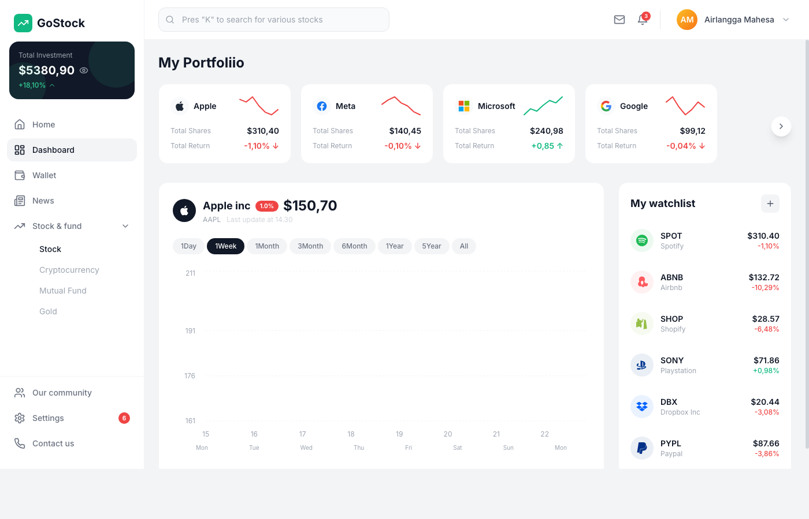

# GoStock Dashboard

A stock portfolio dashboard built with React, Tailwind CSS, and Recharts.



## Getting Started

### Prerequisites

- **Node.js** 18+ and **npm** installed on your machine

### 1. Clone the repository

```bash
git clone https://github.com/ma-sharifi/gostock-dashboard.git
cd gostock-dashboard
```

### 2. Install dependencies

```bash
npm install
```

### 3. Run in development mode (Vite)

```bash
npm run dev
```

Opens at **http://localhost:5173**. Hot-reloads on file changes.

### 4. Build for production

```bash
npm run build
```

Outputs optimized static files to the `dist/` folder.

### 5. Serve production build with @web/dev-server

Build and serve in one command:

```bash
npm run serve
```

Or serve an existing build:

```bash
npm start
```

Opens at **http://localhost:8000** with SPA fallback and watch mode.

## Available Scripts

| Script | Command | Description |
|--------|---------|-------------|
| `npm run dev` | `vite` | Start Vite dev server with HMR |
| `npm run build` | `vite build` | Build optimized production bundle |
| `npm run preview` | `vite preview` | Preview the production build locally |
| `npm run serve` | `vite build && web-dev-server` | Build + serve with @web/dev-server |
| `npm start` | `web-dev-server` | Serve existing build with @web/dev-server |

## Tech Stack

- **React 18** — UI framework
- **Tailwind CSS 3** — Utility-first styling
- **Recharts** — Chart library
- **Lucide React** — Icon set
- **Vite** — Build tool
- **@web/dev-server** — Modern web dev server (serves production build)
